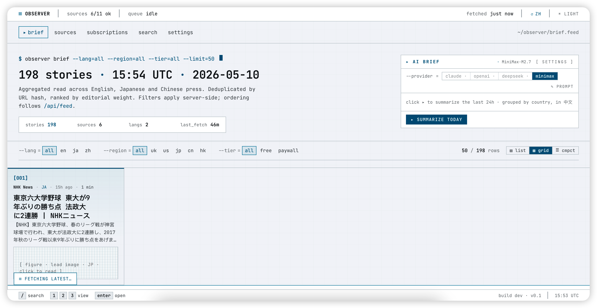
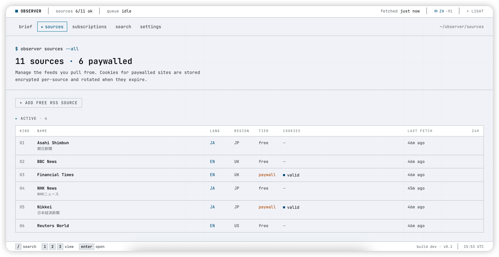
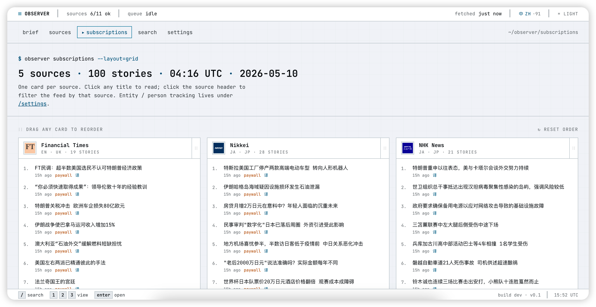

# Observer

Observer 是一个个人新闻聚合系统：后端抓取 RSS 和部分需要登录 Cookie 的新闻源，清洗文章并入库；前端提供一个偏命令行风格的阅读界面，用来浏览多语言新闻、管理来源、按来源订阅、生成 AI 简报和做文章翻译。

本仓库包含两个子项目：

- `news-aggregator/`: Next.js 14 前端
- `observer-backend/`: FastAPI + Celery + Postgres 后端

`imgs/` 目录是本地截图素材，已经加入 `.gitignore`，不会随提交进入仓库。README 使用的是 `docs/images/` 里的可公开截图副本。

## 界面概览

### Brief Feed



首页 brief feed 显示故事数、来源数、语言数、最近抓取时间；右侧有 AI Brief 面板，可选择 provider 并生成当天摘要；下方支持语言、地区、免费/付费、列表/网格视图过滤。

### Sources



来源管理页展示 11 个来源、6 个付费源、Cookie 状态、最近抓取时间和 24 小时文章量；支持新增免费 RSS 来源。

### Subscriptions



Subscriptions 页按来源分组显示文章卡片，适合快速扫读每个来源的最新标题；实体/人物追踪入口在 settings。

## 功能

- 多语言新闻聚合：英文、日文、中文来源统一进入 `/api/feed`。
- 来源管理：RSS 来源可新增和刷新，付费来源显示 Cookie 状态。
- 付费源 Cookie：支持手动导入 Cookie；Nikkei 已有 Playwright 自动登录捕获流程。
- 抓取与清洗：RSS、FT、Nikkei fetcher 走 `trafilatura` / `bleach` 清洗正文，按 URL hash 去重。
- AI 简报：前端首页调用 `/api/ai/summarize`，可配置 Anthropic、OpenAI、DeepSeek、Minimax。
- 翻译：支持批量翻译标题摘要、全文翻译、段落级翻译，并通过 Redis 做缓存。
- 实体订阅：内置人物和公司实体，可订阅或取消订阅。
- 健康检查：后端提供 `/livez`、`/readyz`、`/healthz`。

## 架构

```text
news-aggregator/          Next.js App Router UI
  app/                    页面：brief、sources、subscriptions、search、settings、article detail
  components/             顶栏、文章行、AI summary、翻译切换、主题等组件
  lib/api.ts              前端唯一 API client

observer-backend/         FastAPI API + worker
  app/api/                路由层：feed、sources、entities、settings、ai、translate
  app/services/           业务逻辑：抓取、Cookie、AI、翻译、设置、实体
  app/models/             SQLAlchemy models
  workers/fetchers/       RSS、FT、Nikkei fetcher
  workers/tasks.py        Celery 抓取任务
  alembic/                数据库迁移
  scripts/seed.py         开发数据种子
```

数据流：

```text
Source/RSS/Login cookies
  -> fetcher discovers article URLs
  -> article HTML fetched and extracted
  -> Postgres stores sources, articles, entities, settings, encrypted cookies
  -> FastAPI exposes typed JSON
  -> Next.js renders feed, source management, subscriptions, search and settings
```

## 本地运行

先启动后端：

```bash
cd observer-backend
cp .env.example .env
docker compose up --build
```

后端默认端口：

- API: `http://127.0.0.1:8000`
- OpenAPI: `http://127.0.0.1:8000/docs`
- Postgres: `localhost:5433`
- Redis: `localhost:6380`

再启动前端：

```bash
cd news-aggregator
cp .env.local.example .env.local
npm install
npm run dev
```

前端默认地址：

```text
http://localhost:3000
```

如果后端地址不同，修改 `news-aggregator/.env.local`：

```bash
NEXT_PUBLIC_API_URL=http://127.0.0.1:8000
```

## 常用命令

```bash
# 触发一次来源刷新
curl -X POST http://127.0.0.1:8000/api/sources/refresh

# 手动抓取单个来源
cd observer-backend
docker compose exec worker python -m scripts.dev_fetch bbc --limit 5

# 查看 feed
curl http://127.0.0.1:8000/api/feed

# 前端构建
cd news-aggregator
npm run build

# 后端测试
cd observer-backend
docker compose exec api pytest
```

## 配置与隐私

后端的 Cookie 和 AI provider key 在数据库中用 Fernet 加密保存。生产部署前必须替换 `.env.example` / `docker-compose.yml` 里的开发占位密钥：

```bash
python -c "from cryptography.fernet import Fernet; print(Fernet.generate_key().decode())"
```

## 当前状态

已经可用：

- RSS 抓取、清洗、去重、入库、API 输出
- 首页 feed、来源页、订阅页、搜索页、设置页
- AI provider 设置、AI 简报、翻译接口
- Cookie 手动导入，Nikkei 自动捕获流程

仍在完善：

- Celery 定时调度
- 更多付费源的自动 Cookie 捕获配置
- 实体抽取、通知、全文搜索和向量去重
